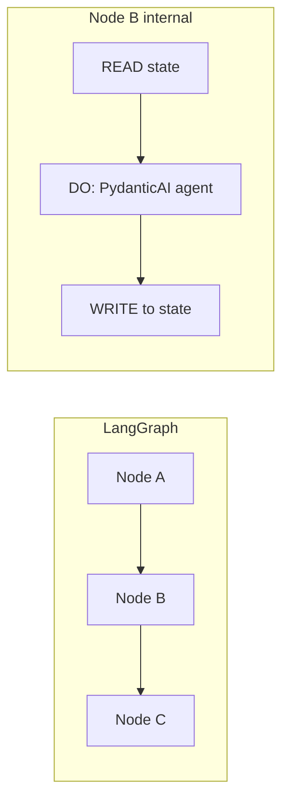

## Workflow Design
* **Structure:** Design simple, modular, and maintainable workflows.
* **State Definition:** Use clear, flat state schemas. Avoid deeply nested or ambiguous structures.
* **State Field Names:** Ensure state fields have meaningful and descriptive names.
* **TypedDict:** Use a `TypedDict` to define the application state.
* **GraphState Consultation:** Before choosing a GraphState structure, consult with the team. State design is critical and affects all components.
* **Edges:** Use edges for logic and conditional routing; avoid complex inline logic. Support loops and branching via graph structure.
* **Conditional Routing:** Prefer conditional routing via edges instead of complex inline logic.
* **Human Intervention:** Support loops, branching, and human intervention through graph structure instead of hardcoded control flow.
* **Visualization:** Create/ensure an images directory exists and save the graph visualization using `workflow.get_graph().draw_png()`.
* **Separation of Concerns:** Separate processing, validation, decision, and integration responsibilities across different nodes.
* **Integration Logic:** Separate integration logic from business logic and anticipate external failures with fallbacks.
* **Testability:** Keep workflows testable and debuggable. Test nodes independently and ensure predictable, repeatable outputs for the same inputs.
* **Incremental Development:** Develop workflows incrementally and validate each addition.
* **Performance:** Optimize performance by minimizing unnecessary state complexity. Isolate expensive computations in dedicated nodes and use caching where helpful.
* **Node Size:** Avoid oversized nodes and unclear state definitions.
* **Planning:** Plan error handling and control flow from the beginning rather than as an afterthought.

## Node Implementation Rules
* **Four-Part Structure:** Each node must follow: **READ** (inputs) → **DO** (logic/tool) → **WRITE** (outputs) → **CONTROL** (next action).
* **Single Purpose:** One node = One logical task. Do not mix heavy work with routing decisions.
* **Field Ownership:** Assign each state field to a single "owner" node to avoid accidental overwrites.
* **Executable Only:** Do not create "comment-only" nodes. Nodes must perform work or governance.
* **Classes:** Separate logic into structured classes that are easily extensible for the State.

## PydanticAI as Agent Engine in Nodes
* **Division of Responsibility:** LangGraph owns high-level flow: graph structure, state (TypedDict), edges and conditional routing, interrupts (human-in-the-loop), checkpoints and persistence. Do not move this responsibility to PydanticAI. PydanticAI is used optionally **inside** a node to implement the **DO** (agent logic) when the node calls an LLM and needs structured output: prompt, tools for that step, and validated output.
* **When to Use PydanticAI in a Node:** Use when the node calls the LLM and needs **structured output** (e.g. a Pydantic model with `summary`, `technologies`, `structure`) — use PydanticAI with `output_type` for validated output without manual parsing. Use when the node needs **dependency injection** (DB, HTTP client, settings) — PydanticAI's DI is cleaner than Runnable/LCEL inside a node. For **deterministic-only** nodes (no LLM call), PydanticAI is not required; use plain logic or LangChain as usual.
* **READ→DO→WRITE→CONTROL:** **READ** from graph state as today. **DO:** optionally call a PydanticAI agent (e.g. `result = await agent.run(...)` with input derived from state); the result is a validated object per the output model. **WRITE:** update state from `result` (already typed and validated). **CONTROL:** unchanged — edges and routing remain LangGraph's responsibility.

## Error Handling & Reliability
* **Explicit Handling:** Wrap core logic in `try/except`. Append errors to a dedicated `errors` field.
* **Routing:** Route persistent failures to dedicated error-handling or human review nodes.
* **State Reset:** On node success, reset `ERROR_COUNT=0` in the Global State.
* **State Aggregation:** Add agent summaries (e.g., `summary_for_supervisor`) to the `messages` list in Global State.

* **See:** `error-handling-and-resilience.md` for comprehensive error handling and resilience patterns including retry strategies, circuit breakers, and graceful degradation.

## Checkpoints & Interrupts
* **Persistence:** Save checkpoints.
* **Human-in-the-Loop:** Use interrupts where required.

## Multi-Agent Systems
* **See:** `multi-agent-systems.md` for comprehensive patterns on orchestrating multiple agents, including Orchestrator/Worker/Synthesizer architecture, SECTIONS pattern, FAN-OUT/FAN-IN patterns, and fallback agents.
